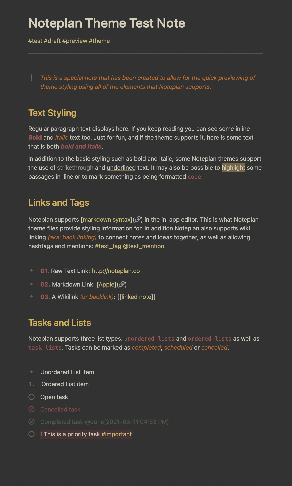

# Subdued - Noteplan Theme
---
This is a custom theme file for the macOS application [NotePlan 3](https://noteplan.co). Please note, custom themes require NotePlan 3 v.3.0.19 or later to be supported.

### Theme Features
- Subdued is a `Dark Theme` (light text on dark background)
- Use of warm and earthy tones throughout for a comfortable feel
- Use of varying degrees of opacity for a `subdued` appearance
- Use of standard fonts so no additional font dependencies
- Support for custom syntax: *underline*, *strikethrough* and *highlights*

### Todo
- Add additional headings (h4 - h6) and their styling
- Create a light version of this theme

## Installing a Custom Theme
To install the **Subdued** theme, simply download the .json file, open NotePlan 3 > Preferences > Themes, and choose `Import Theme...`. Then locate the .json file you downloaded. Once installed, custom themes are listed below the default built-in themes.

## Customisation
You can add or edit this themes colouring and functionality by editing the .json theme file. More information about supported NotePlan 3 styles and detailed documentation can be found [here](http://noteplan.co/createcustomthemes)
